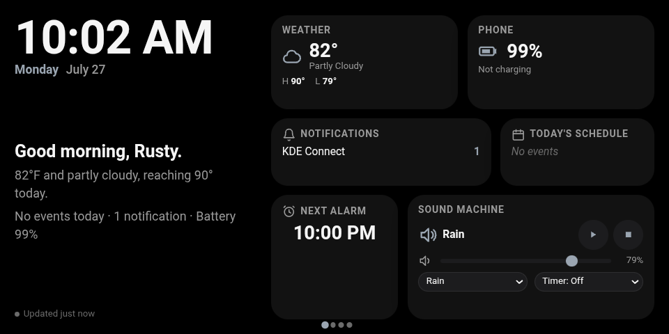
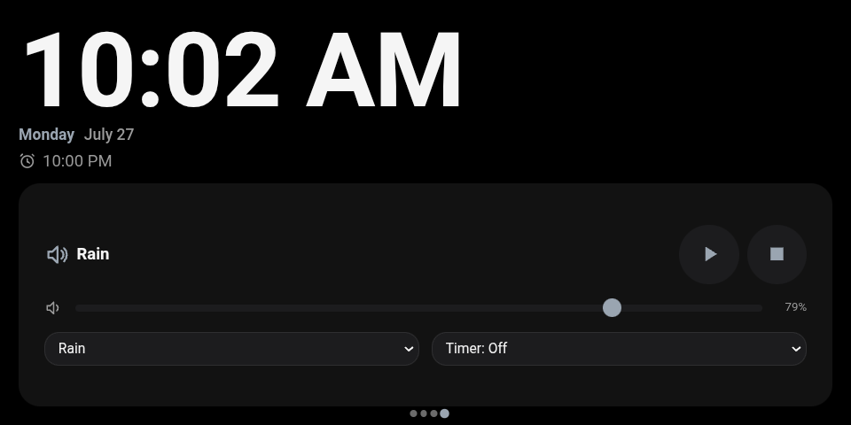

# echo-dashboard


A dark, swipeable bedside dashboard for a repurposed Amazon Echo Show,
built entirely in vanilla HTML/CSS/JS — no framework, no bundler, no
`node_modules`. It pulls from [**Aurora**](https://github.com/rustyisacat/Aurora) v4.0, a
companion Android app, over your home Wi-Fi and turns an old smart display
into a self-hosted phone status board, morning briefing, bedside alarm
clock, bedside sound machine, and an idle-screensaver photo frame — themed
however you like, right down to matching your own wallpaper's colors.

<p align="center">
  
  
</p>

## Features

- **Six swipeable pages** (CSS scroll-snap, real touch scrolling, tap-to-jump
  dot indicators): a Morning Overview, a dedicated Phone page, a Daily Info
  page, a Clock/Alarm/Sound Machine page, a Wake Alarms page, and a
  Settings page for picking a theme. Two more full-screen views live
  outside that swipeable set entirely, summoned rather than swiped to —
  see Bedside Mode and Ambient Mode below.
- **Morning Briefing**: a one-glance summary composed client-side from
  weather, calendar, and rain forecast — a greeting, today's conditions
  (with an umbrella warning if rain is expected), and a countdown to your
  next calendar event. The same rain heads-up also shows directly on the
  Weather card and the Daily Info page, in case you scroll past the
  briefing without reading it.
- **Wake Alarms**: set, edit, and delete Aurora's own alarms right from
  this display — time, repeat days, and which sound rings. When one
  fires, a full-screen overlay takes over (any page, not just wherever you
  left it) with a looped alarm sound and Dismiss/Snooze, and automatically
  stops whatever the ambient sound machine was doing so the two don't
  overlap.
- **Bedside Sound Machine**: built-in and custom ambient sounds, looped
  gaplessly via the Web Audio API and played through the display's own
  speakers — control it from the dashboard itself or from the Aurora phone
  app, they stay in sync.
- **Bedside Mode**: one tap (the moon icon next to the clock) starts rain
  (optional — toggle "Play sound automatically" off in Settings if you'd
  rather just have the dimming/DND/quiet clock with no sound), dims the
  display to a comfortable 50% (adjustable live via an on-screen slider),
  silences the phone (flips Do Not Disturb on, same as the Notifications
  card's toggle, and back off again on exit), and arms any disabled wake
  alarms — then summons a dedicated full-screen view with a huge centered
  clock, tomorrow's first event, and the Sound Machine controls, until you
  tap the exit button. Can also enter itself automatically at a scheduled
  time each night, from that same Settings section.
- **Ambient Mode**: after 30 minutes with no touch (never while Bedside
  Mode is active), a screensaver-style view takes over — huge clock, tiny
  weather line, dimmed — cycling your Aurora-picked photos with a slow
  crossfade, or a twinkling starfield if you haven't picked any yet. The
  same animated weather effect that plays over the main dashboard bleeds
  through here too, dimmed along with everything else, instead of
  disappearing behind the screensaver. Any touch exits it instantly.
- **Configurable main-UI wallpaper**: the same photo library you pick for
  Ambient Mode drives the main dashboard's background too (scrimmed for
  legibility) — pick from the Aurora phone app whether it rotates the
  whole library slowly (the default), locks to one fixed photo, or
  follows a time-of-day schedule you build there with real thumbnails and
  a time picker. Whichever photo's showing, its dominant color (extracted
  client-side) becomes the dashboard's accent color, taking over from the
  weather-driven default.
- **Do Not Disturb toggle**: silence the phone straight from the
  Notifications card — it flips Android's real system DND, so calls and
  notifications stay quiet until you toggle it back.
- **Notification icons and previews**: each app in the Notifications card
  shows its real launcher icon plus a one-line preview of its latest
  notification, not just a bare count — which apps show up at all is
  controlled from the Aurora phone app's Notification Apps card.
- **Charging ETA**: the Phone card shows "Full in ~X min" once Aurora has
  enough recent charge-rate history to estimate it.
- **8 Dashboard Themes** (Material You, Nothing OS, Pixel, Retro CRT, OLED
  Minimal, Catppuccin, Nord, Gruvbox), switchable from the Settings page —
  each swaps palette, typography, shape, and shadow style over the same
  shared layout, no separate frontends to maintain.
- **Animated weather backgrounds**, one of 8 richly layered effects
  (Clear, Partly Cloudy, Overcast, Fog, Rain, Snow, Thunderstorm, Night)
  playing in front of every page and the wallpaper alike - a rotating-ray
  sun with its own lens-flare glint, puffy multi-lobed clouds (an actual
  unbroken cloud ceiling for Overcast; the sun visibly dims as a cloud
  passes over it for Partly Cloudy), a milky fog wash with a diffused glow
  struggling through it, rain that genuinely falls (directional streaks
  with a slower glass-trickle layer underneath, not symmetric blobs), snow
  and stars scattered irregularly across three depth layers instead of a
  repeating tile, real lightning bolt shapes on two independent, unsynced
  timers, and a moon glow with an occasional shooting star at night. All
  CSS, no JS per-frame cost. Automatically absent during Ambient Mode and
  Bedside Mode, which already own the whole screen.
- **Weather Background override**: from the Settings page, force any of
  those 8 effects on demand - for 15 minutes up to indefinitely, or "rest
  of day" - or put one on a recurring daily schedule, independent of
  what's actually happening outside.
- **Severe weather alerts**: an active NWS warning for Aurora's location
  shows as a banner on the Overview and Daily Info pages until it clears -
  tap the × to dismiss just that alert; a new or changed one still shows
  even with a prior one dismissed.
- **Polish animations throughout**: rolling numbers for temperature and
  battery, a filling battery gauge, a weather-icon transition on change, a
  scroll-driven page-transition effect while swiping, and a livelier
  alarm-ringing pulse.
- **Low battery banner**: a red warning appears on the Overview page if
  the phone is genuinely low and not charging — a bedside device dying
  overnight defeats the point.
- **Auto-dim at night, brightens in the morning**: the whole display dims
  itself for bedside comfort using actual sunrise/sunset (falls back to a
  fixed 9pm–7am window until the first weather fetch), and nudges the real
  hardware backlight too if Fully Kiosk Browser's JS interface is enabled.
- **Customizable layout**: the Morning Overview's card order, visibility,
  and size are controlled from the Aurora phone app and picked up here
  automatically, no code changes needed.
- **Dynamic accent color** that shifts with the current weather condition
  by default, or follows the rotating wallpaper's colors once your photo
  library has photos (see above) — every theme keeps this behavior, it's
  not something themes override.
- **Resilient by default**: the last good response is cached and shown
  immediately on load, survives Aurora going offline, and quietly shows a
  reconnecting/offline status instead of ever going blank.

## Requirements

- [Aurora](https://github.com/rustyisacat/Aurora) v4.0+ running on a phone on the
  same Wi-Fi network as whatever device will display this. The Settings
  page's write controls (name, home network, notification blocklist,
  wallpaper, dashboard layout) need Aurora v4.0 specifically for their
  HTTP routes; Ambient Mode's photo rotation and the dashboard wallpaper
  need v3.0 at minimum (earlier versions don't have the Photo Picker
  endpoints); everything else works against v2.0 too.
- Any modern browser. Built and tested for a kiosk browser (e.g.
  [Fully Kiosk Browser](https://www.fully-kiosk.com/)) on a rooted/sideloaded
  Amazon Echo Show 5 (1st gen), but nothing here is Echo-Show-specific —
  it renders fine in any browser window.

No build tools, no package manager, no dependencies: just `index.html`,
`style.css`, and `script.js`, served as static files.

## Installation

1. **Clone the repo:**

   ```
   git clone https://github.com/rustyisacat/echo-dashboard.git
   cd echo-dashboard
   ```

2. **Point it at your Aurora instance** — edit the two constants at the
   top of `script.js`:

   ```js
   const DEFAULT_AURORA_HOST = "192.168.1.130";
   const DEFAULT_AURORA_PORT = 8080;
   ```

   Or skip editing the file entirely and load the page once with a query
   string — e.g. `http://<this-server>/?host=192.168.1.130&port=8080` —
   the override is remembered in `localStorage`, so a kiosk browser only
   needs it on the very first load.

3. **Serve the three files.** Any static file server works:

   ```
   python3 -m http.server 8090
   ```

   then open `http://localhost:8090/`.

4. **Point your display's browser at that URL** and set it to kiosk/full-screen
   mode. On Fully Kiosk Browser, either serve these files from a small local
   HTTP server on the device itself, or use a `file://` URL if your kiosk
   setup allows it — either way, keep all three files in the same directory.

5. **Confirm Aurora sends CORS headers.** `/dashboard` and `/health`
   responses need `Access-Control-Allow-Origin`, or the browser will
   silently block this page's JS from reading them (the request itself
   still succeeds — only reading the response is blocked). Aurora sends
   this by default; only relevant if you're pointing this at a modified
   or much older Aurora build.

6. **(Optional) Enable Fully Kiosk's JS interface** if you want the
   night auto-dim feature to control the actual screen backlight, not
   just this page's own contents. Without it, auto-dim still works, just
   as a CSS-only effect.

## How it behaves

- **Two independent update loops.** The clock ticks every second off the
  browser's own local time; `/dashboard` is pulled every 30 seconds.
  Neither affects the other.
- **Never blank.** The last successful `/dashboard` response is cached in
  `localStorage` and rendered immediately on load, before the first fetch
  even completes. If Aurora becomes unreachable, the dashboard keeps
  showing that cached data instead of going empty.
- **Quiet about connectivity.** A small status line is invisible while
  data is fresh. After a few consecutive failed pulls it shows
  "Reconnecting to Aurora…", then "Offline - showing data from X min ago"
  if the outage continues.
- **Values pulse briefly** on change (a CSS animation) so an update reads
  as a small "beat" rather than a silent jump-cut — only fields that
  actually changed animate.
- **Sound Machine survives reloads and reboots.** Aurora remembers what
  *should* be playing; the very first pull after this page loads (or the
  whole display reboots) notices and resumes it automatically. A ringing
  Wake Alarm is reconciled the same way, so a reload that happens to land
  mid-ring picks it right back up.
- **Theme choice persists locally** (`localStorage`, applied synchronously
  before the page paints, so there's no flash of the wrong theme on
  reload) — it's a display preference, not something Aurora needs to know
  about.
- **PWA basics** (`manifest.json` + `sw.js`): "Add to Home Screen"-installable,
  and the app shell (`index.html`/`style.css`/`script.js`) is cached so a
  brief network drop doesn't blank the page — Aurora's own live data still
  needs the network either way, only the shell that draws it is cached.
  Note: service workers require `https:` or `http://localhost` and simply
  don't register under a `file:` origin, which is how this dashboard's
  real Echo Show deployment loads — there this silently no-ops, harmless
  either way.
- **Stale-clock watchdog.** A kiosk display running 24/7 is the one place
  a silently frozen tab actually matters. Every successful clock tick
  stamps the time it completed; a separate check every 30s reloads the
  page if 5 minutes pass with no successful tick — catching a persistent
  broken state (an exception on every tick) or a badly degraded WebView,
  not a graceful fix for every possible freeze, since a genuinely
  deadlocked main thread can't run its own watchdog either.
- **Voice dismiss/snooze.** While a Wake Alarm is actually ringing, saying
  "snooze" or "dismiss" works the same as tapping the button, via the
  browser's built-in `SpeechRecognition` — only listening during that
  window, not all the time. Requires microphone permission granted to the
  kiosk browser app itself (an OS-level setting) and `SpeechRecognition`
  support, which not every WebView has; both fail silently into "just use
  the buttons" rather than a stuck or broken state.

## Adding a new card

1. Add a `<section class="card">` to `index.html`'s Morning Overview page
   (a `card-title` heading + whatever elements you need, each with a
   unique `id`), and an entry in `TILE_DOM_ID`/`DEFAULT_TILE_LAYOUT` in
   `script.js`.
2. Add one `renderX(data.x)` function in `script.js`, next to
   `renderWeather`/`renderPhone`/etc., and call it from `renderDashboard()`.
3. No changes should be needed to the pulling, caching, layout, or
   connection-status code — all of it is already generic over "whatever
   the current `/dashboard` response and layout say."

## AI Disclaimer

Parts of this project were assisted or written by AI. If that's something
you're not comfortable with, no hard feelings, I understand and I don't
force anyone to use it. The code may have flaws. If you spot something
that could be better, contributions are very welcome. I'm still learning
and would appreciate the help.

## License

[AGPL v3](LICENSE)
